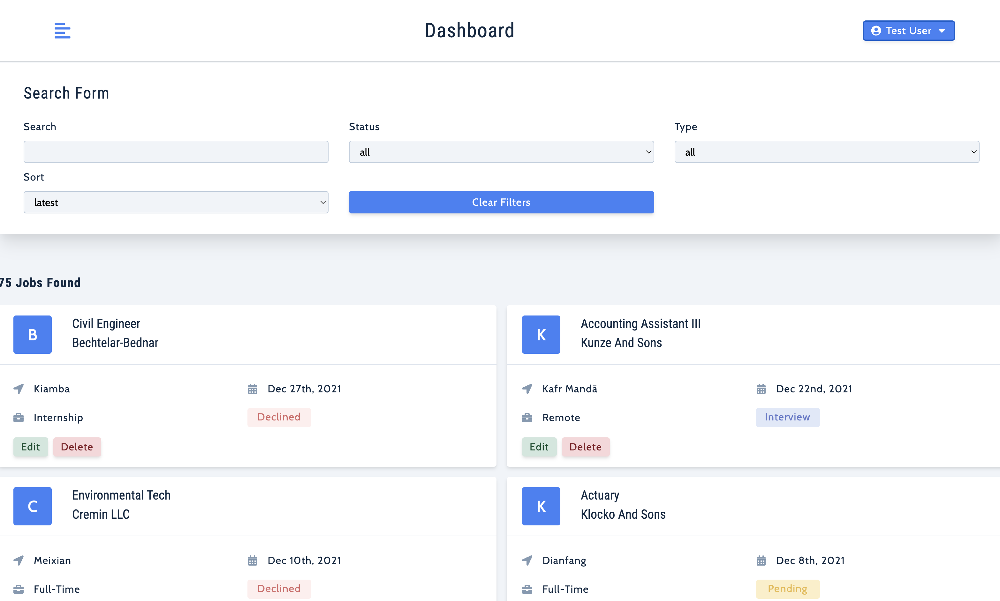

# Job Board

This job board app is a platform that provides a platform for job seekers to search and apply for job openings, and for employers to post job vacancies and manage applications.

[Demo App Link](https://job-board-project.netlify.app/)

demo username: `testUser@test.com`

demo pass: `secret`



## Run The App Locally

```sh
npm run install && npm start
```

- visit url http://localhost:3000/

## Tech Stack:

- React
- Redux toolkit
- Axios
- Moment
- Styled Components
- Recharts
- Netlify
